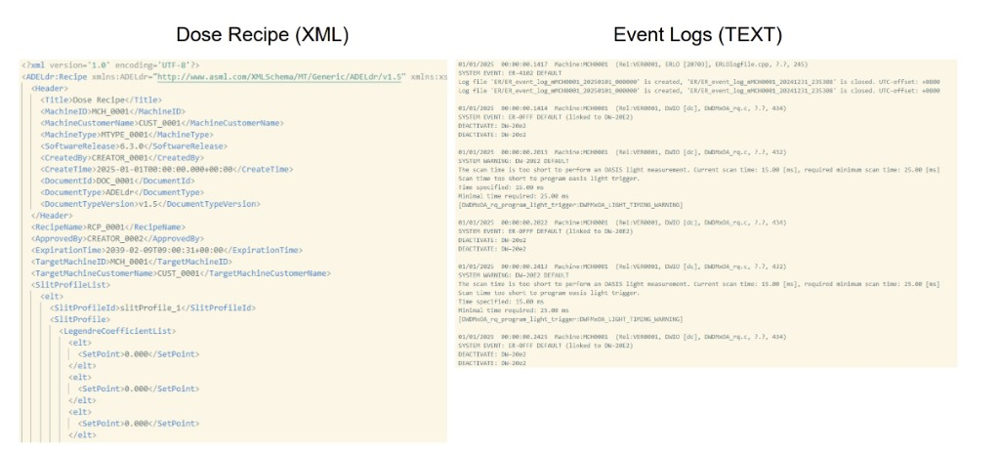
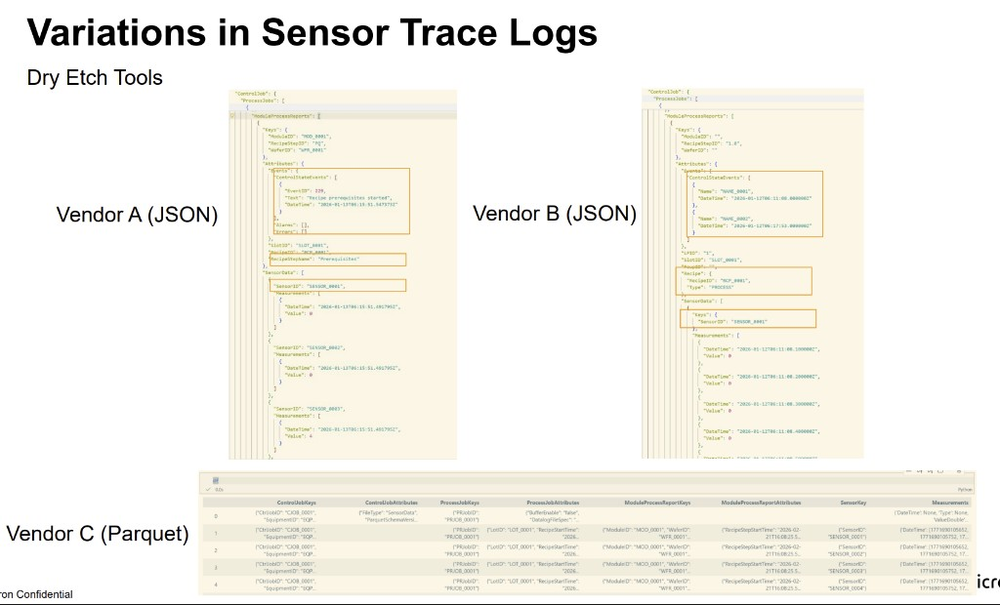

# Smart Semiconductor Tool Log Parser - User Guide

Version: 1.1  
Last updated: 2026-03-14

This guide is written for:

- non-technical users who want to understand what happens after upload
- hackathon judges reviewing practical business value
- new engineers onboarding to tool-log analytics workflows

## Table of Contents

1. [What This Product Is](#what-this-product-is)
2. [Why This Matters in Semiconductor Manufacturing](#why-this-matters-in-semiconductor-manufacturing)
3. [Before You Start](#before-you-start)
4. [Quick Start](#quick-start)
5. [Supported Log Types](#supported-log-types)
6. [Step-by-Step: What Happens After Upload](#step-by-step-what-happens-after-upload)
7. [How to Use Each Dashboard](#how-to-use-each-dashboard)
8. [Golden Run and Drift Detection](#golden-run-and-drift-detection)
9. [Streaming Simulation](#streaming-simulation)
10. [Troubleshooting](#troubleshooting)
11. [FAQ](#faq)
12. [Security and Data Handling Notes](#security-and-data-handling-notes)
13. [Glossary](#glossary)
14. [Support and Next Steps](#support-and-next-steps)

## What This Product Is

Semiconductor equipment logs are usually large, inconsistent, and difficult to read directly.  
This product converts those raw logs into clean, structured events and visual dashboards.

In plain words:

1. You upload a raw machine log.
2. The system figures out its format.
3. It extracts key information (tool, chamber, parameter, alarms, step, time).
4. It shows results in dashboards for faster troubleshooting and decisions.

## Why This Matters in Semiconductor Manufacturing

In fab operations, a single incident can involve:

- multiple tools and chambers
- different log formats from different vendors
- missing fields in some lines
- alarms appearing before/after parameter drift

Without structure, engineers spend time manually searching text files.  
This platform reduces that manual work and helps teams move from "raw text" to "actionable insights."

## Before You Start

You need:

- Node.js 18+
- Python 3.11+
- project `.env` configured (especially `GROQ_API_KEY` for LLM fallback)

If this is your first time:

1. Copy `.env.example` to `.env`
2. Add your `GROQ_API_KEY`
3. Keep `.env` local only (do not commit it)

## Quick Start

From project root:

```sh
npm install
npm --prefix frontend install
npm run dev
```

Open:

- Frontend: `http://localhost:8080`
- Backend API docs: `http://localhost:8000/docs`

`npm run dev` starts frontend and backend together.

## Supported Log Types

- JSON
- XML
- CSV
- key-value logs
- syslog logs (including RFC-style patterns)
- plain text logs
- hex logs
- binary logs (`.bin`)

## Real-World Log Variation Examples

These examples show why one parser is not enough in semiconductor environments.

### Example A: Recipe/Process logs in different styles



### Example B: Sensor traces across vendors



## Step-by-Step: What Happens After Upload

This section explains each processing stage and why it exists.

### Step 1 - Upload and run creation

- A unique `run_id` is created for each upload.
- The file is validated and safely stored.

Why: all events and dashboards must be tied to one consistent session.

### Step 2 - Format detection

- The backend inspects content patterns and bytes (not extension alone).
- It outputs format + confidence (for example: `syslog`, `0.82`).

Why: different formats require different parsers.

### Step 3 - Parser routing

- The file is routed to a specific parser path.
- Structured logs use deterministic parser logic first.

Why: deterministic parsing is fast and reproducible.

### Step 4 - Data extraction

The parser extracts:

- timestamp
- tool/chamber context
- recipe/step
- parameter and value
- alarms and severity clues
- original raw line for traceability

Why: raw strings become machine-readable events.

### Step 5 - Recovery and fallback

If parse result is weak or empty:

- the service tries alternative deterministic parsers
- if still uncertain, it can use LLM-assisted classification/enhancement

Why: imperfect files should still produce useful output.

### Step 6 - Normalization

Vendor aliases are standardized:

- `TEMP_C`, `Temp`, `temperature` -> `temperature`
- `PRESSURE_TORR`, `Pressure` -> `pressure`
- `RFPOWER`, `rf_power_w` -> `rf_power`

Why: comparisons only work when names are consistent.

### Step 7 - Validation

Rows are validated for schema and data quality.  
Uncertain rows are marked as partial instead of crashing the run.

Why: robust system behavior even with missing information.

### Step 8 - Deduplication

Duplicate events are dropped within the run scope.

Why: repeated/replayed lines should not inflate charts or alarm counts.

### Step 9 - Storage and summary

- Events are saved to database tables.
- Summary metrics are computed for dashboards.

Why: queries become fast and repeatable.

### Step 10 - Dashboard and API output

The frontend receives:

- parsed events
- format label and confidence
- summary cards
- trend/timeline data

Why: users see outcomes quickly without reading raw logs manually.

## How to Use Each Dashboard

Use this workflow from left to right:

- **Overview:** first triage screen (status, alarm volume, run scope)
- **Data:** detailed event table for exact row-level verification
- **Trends / Analytics:** parameter behavior over time
- **Recipe / Timeline:** step-by-step process progression
- **Alarms / Anomaly:** incident-focused investigation
- **Health:** tool/chamber stability snapshot
- **Golden Run:** baseline comparison for drift
- **Raw Log:** source traceability
- **Report:** shareable summary for handoff and reviews
- **Architecture:** visual explanation of pipeline

## Golden Run and Drift Detection

Use a known stable run as baseline:

1. Mark baseline run as golden.
2. Compare current run against golden.
3. Review deviations by parameter/tool/chamber.
4. Investigate high-deviation items in Trends + Raw Log.

Why this is valuable: drift often appears before hard alarm thresholds.

## Streaming Simulation

For near-real-time behavior:

1. Start stream session
2. Append log chunks periodically
3. Parse and merge continuously
4. Finish stream and lock final status

This simulates continuous fab telemetry ingestion.

## Troubleshooting

- **UI cannot load data**
  - Confirm `npm run dev` is running in project root.
  - Check backend docs page at `http://localhost:8000/docs`.

- **Upload rejected**
  - Verify extension is allowed and file is within size limit.

- **Unexpected blank/empty charts**
  - Check if parsed run has parameter-reading events.
  - Confirm selected filters are not too restrictive.

- **Values look wrong**
  - Inspect `Raw Log` and compare with `Data` row values.
  - Look for unit and naming differences from source vendor.

- **Run has partial rows**
  - This is expected for missing/ambiguous lines.
  - Continue investigation with available complete rows and context.

## FAQ

### Q1: What if my file has missing fields?
The system does not fail the entire run. It keeps processable rows, marks uncertain rows as partial, and continues.

### Q2: Does the system use LLM for every line?
No. Deterministic parsing is primary. LLM is used selectively for ambiguous/partial cases.

### Q3: Can I compare two runs?
Yes. Use Golden Run comparison and drift views.

### Q4: How do I verify parser correctness?
Use `Raw Log` + `Data` table side-by-side and check exact mapped values.

### Q5: Can I test without real fab logs?
Yes. Use synthetic endpoints from backend for demo data generation.

## Security and Data Handling Notes

- Uploads are treated as untrusted input.
- Only approved file types are accepted.
- File size limits are enforced.
- XML parsing uses safe configuration.
- API keys stay on backend (`.env`), not frontend.
- Raw lines are preserved for audit traceability.

## Glossary

- **Run:** one upload/processing session with its own `run_id`.
- **Event:** one structured record extracted from raw log content.
- **Normalization:** mapping vendor-specific names into canonical names.
- **Partial row:** a row with missing/uncertain fields kept for context.
- **Golden run:** a known-good baseline used for drift comparison.
- **Drift:** measurable deviation from baseline process behavior.

## Support and Next Steps

Recommended first-time usage path:

1. Upload sample/synthetic file.
2. Open Overview and Data.
3. Check Trends for `temperature`, `pressure`, `rf_power`, `gas_flow`.
4. Review Alarms, then compare with Golden Run.
5. Validate key findings using Raw Log.

Practical outcome: faster root-cause analysis and clearer process communication.
